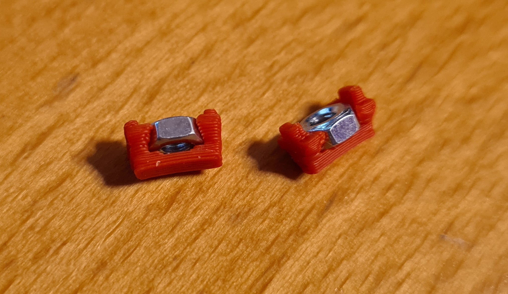
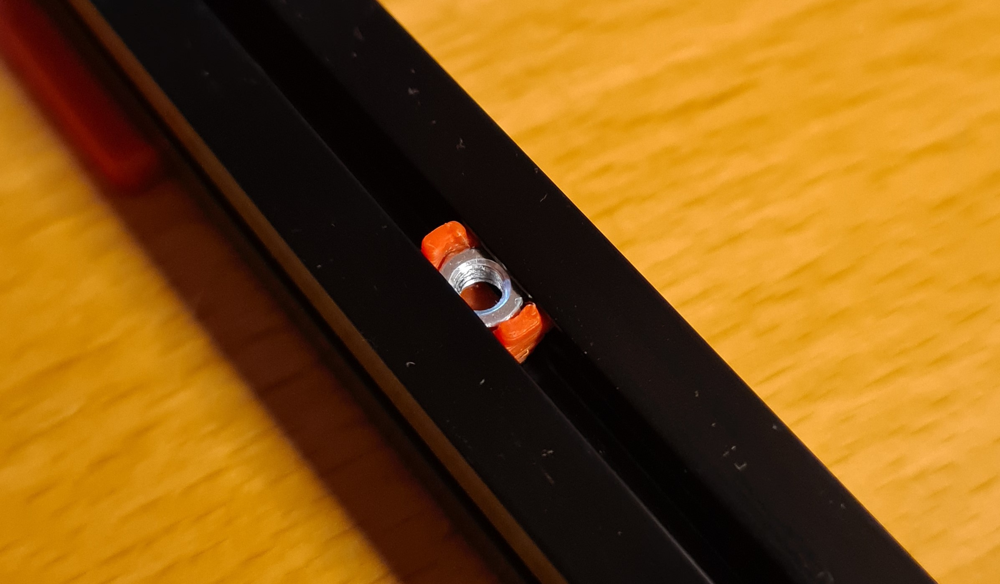

# SteadyNut Makerbeam XL

This little mod will turn ordinary M3 nuts into t-nuts for Makerbeam XL extrusions. Because of the friction fit, the nuts will stay in place and will prevent a lot of frustration of M3 nuts sliding out of the extrusions.

# Note
Please keep in mind that using these SteadyNuts will decrease the depth of the bolts by 1mm:

# Credits
This mod was directly inspired by Discord user `zruncho V0.078` after he posted pictures of his SteadyNut made for LDO profiles.
